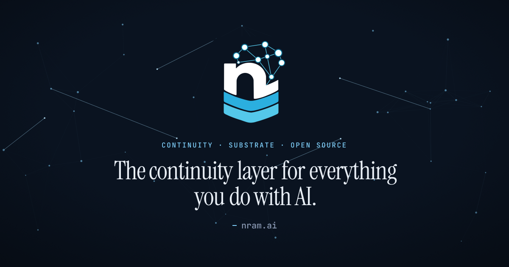

<p align="center">
  <a href="https://nram.ai"></a>
</p>

<p align="center">
  <a href="https://github.com/nram-ai/nram/actions/workflows/ci.yml"></a>
  <a href="https://github.com/nram-ai/nram/actions/workflows/ci.yml"></a>
  <a href="https://goreportcard.com/report/github.com/nram-ai/nram"></a>
  <a href="LICENSE"></a>
  <a href="https://github.com/nram-ai/nram/stargazers"></a>
</p>

<p align="center">
  
  
  
  
  
</p>

<p align="center">
  <a href="#what-is-neural-ram">What is it</a> &middot;
  <a href="#get-running">Get running</a> &middot;
  <a href="docs/quickstart.md">Quick Start</a> &middot;
  <a href="#reference">Docs</a> &middot;
  <a href="https://nram.ai">nram.ai</a>
</p>

> Work in progress: under active development. Expect rough edges, and feedback is welcome.

## What is Neural Ram?

Right now, **you** are the continuity layer between your AI tools. You copy context from Claude into ChatGPT, write handoff docs, re-explain the same decisions, and lose a little more each time you switch tools or machines.

nram takes that job off you. It is one self-hosted server that keeps what mattered across every tool, every conversation, and every machine, on infrastructure that belongs to you. Your agent already reads the PDF, watches the video, runs the test, scrapes the page; nram's job is to keep what mattered. Context, not storage.

It is a real server, not a library or a localhost shim: a single MIT-licensed binary with OAuth, passkeys, multi-tenancy, and MCP over HTTP, so your laptop, desktop, and phone all see the same brain. And it is more than a database with vector search: it pulls facts and entities out of your free-text notes, builds a knowledge graph of how they connect, and runs a background *dreaming* cycle that consolidates, dedups, and prunes while the server is idle, like a notebook that quietly reorganizes itself overnight.

### One substrate, many jobs

nram is not another memory tool bolted onto one app. It is the layer underneath them, so a single server covers work that today is split across separate products:

| Job | What nram provides | Comparable tools |
|---|---|---|
| Conversational continuity | Memory that survives across sessions, tools, and vendors, reachable over MCP. | Claude Memory, ChatGPT Memory |
| Document-corpus recall | Semantic search, an entity-deduped knowledge graph, and consolidation over a stored corpus. A substrate, not a chat UI. | NotebookLM, AnythingLLM, Khoj |
| Procedural rules | A first-class verbatim tier for standing rules, conventions, and protocols an assistant loads at session start. Returned byte-for-byte, never embedded or paraphrased. | (no direct equivalent) |
| Persona / self-knowledge (`about_me`) | A reserved, fully-indexed tier for identity, preferences, and ongoing context that surfaces by association on every recall. | (no direct equivalent) |
| Agent memory | Persistent memory for coding, research, and custom agents, with consolidation and a knowledge graph on top. | Mem0, Letta, Zep, Graphiti |

## Features

### Recall that actually finds things

- Hybrid **vector + lexical** search (FTS5 on SQLite, `tsvector` on Postgres) fused with Reciprocal Rank Fusion and boosted by the knowledge graph.
- **Relevance-first ranking**: query relevance is the base score; priors like recency, importance, and frequency refine the order but never let an off-topic memory outrank the on-topic answer.
- **MMR de-dup** keeps results diverse, and **multi-vector facets** match a query against a memory's best sub-topic instead of a diluted average.
- An optional **reranker** (cross-encoder `/v1/rerank` or LLM judge, auto-detected) re-scores the top candidates for relevance.

### A knowledge graph that builds itself

- **Two-pass extraction**: background workers pull facts and entities from your free text, then infer the relationships between them.
- A **closed type vocabulary** keeps the graph canonical instead of sprouting near-synonym labels, and a cleanup pass folds duplicate nodes back together.
- **Query augmentation** paraphrases each memory into short retrieval queries so recall matches the way people actually ask.
- An optional **ingestion judge** decides add / update / delete / none against near-duplicates before extraction runs.

### Dreaming, an offline consolidation cycle

- A **twelve-phase** cycle that dedups entities, backfills embeddings and facets, infers transitive relationships, detects contradictions, consolidates, prunes, and recomputes weights while the server is idle.
- Consolidation **clusters related memories** by embedding similarity so syntheses stay coherent, and an LLM **novelty audit** demotes low-value ones.

### Ask: one cited answer, not a list (optional)

- Synthesizes a grounded, **footnote-cited** answer over your memories in a single model call, across every project or one scoped project.
- **Decomposes** aggregation questions per class, gates out off-topic neighbors, and returns "not in neighborhood" rather than fabricating when the answer isn't there.
- Off by default behind a feature flag and its own provider slot; prompt-injection-fenced before synthesis.

### Tiers built in

- **Procedural**: a verbatim per-user tier for rules and protocols, stored byte-for-byte and never embedded, enriched, or rewritten.
- **Persona (`about_me`)** and **global** tiers are reserved, auto-provisioned, and always join the recall aperture.

### A real server, not a localhost shim

- **Auth**: OAuth 2.0 (Authorization Code + PKCE, dynamic client registration, resource indicators, discovery), JWT, WebAuthn passkeys, per-org OIDC SSO, and five RBAC roles across REST and MCP.
- **Multi-tenancy**: organizations, hierarchical namespaces, and projects, plus scoped share tokens for access without an account.
- **Storage**: SQLite (zero-config) or PostgreSQL, with pgvector, a pure-Go HNSW index, or Qdrant for vectors, and SQLite-to-Postgres migration tooling.
- **Provider-agnostic**: OpenAI, Anthropic, Google Gemini, Ollama, OpenRouter, vLLM, SGLang, llama.cpp's llama-server, and any OpenAI-compatible endpoint, with per-call token accounting.
- **Operability**: a React Web Console, real-time SSE, HMAC-signed webhooks, Prometheus metrics at `/metrics`, JSON / NDJSON import/export, and a persistent instance identity (UUID + ES256 keypair) surfaced in `nram --version`.

### How clients connect

- **MCP** is how Claude, ChatGPT, Cursor, or a custom agent connects. Streamable HTTP transport at `/mcp`, with OAuth discovery at the well-known paths.
- **REST API** lets any code that can speak HTTP store and recall. See [docs/api.md](docs/api.md).
- **Web Console** is the dashboard for organizations, projects, providers, the knowledge graph, and the dreaming cycle.

## Get running

**Fastest path** is a prebuilt binary (no Go or Node needed). Grab the right archive for your OS from the [nightly release](https://github.com/nram-ai/nram/releases/tag/nightly), extract it, and run:

```bash
./nram
```

**From source:**

```bash
git clone <repo-url> nram && cd nram
make build      # builds the UI and compiles a single ./nram binary
./nram
```

Either way, open `http://localhost:8674`, create the admin account, and **save the API key, it is shown only once.** Then configure an LLM provider under **Settings → Providers** (nram falls back to keyword-only recall until you do).

- Per-OS download and checksum steps: **[docs/install.md](docs/install.md)**
- Full setup walkthrough, providers, and connecting Claude / ChatGPT / Cursor: **[docs/quickstart.md](docs/quickstart.md)**

Connect Claude Code in one line:

```bash
claude mcp add --transport http nram http://localhost:8674/mcp
```

Local CLI and IDE tools use the URL directly. Hosted web tools (ChatGPT, claude.ai, the Claude apps) reach your server from the vendor's cloud, so they need a public HTTPS URL via a reverse proxy or tunnel, see [docs/quickstart.md](docs/quickstart.md#7-connect-a-client).

## Reference

The deep reference is split out to keep this page approachable:

- **[docs/install.md](docs/install.md)**: prebuilt downloads for macOS, Linux, and Windows, and checksum verification.
- **[docs/quickstart.md](docs/quickstart.md)**: build, run, the setup wizard, provider configuration, and connecting a client.
- **[docs/api.md](docs/api.md)**: full REST API and MCP tool/resource reference, including update/supersede and move semantics.
- **[docs/models.md](docs/models.md)**: recommended models per slot, VRAM sizing for local models, the optional reranker, and Ollama `num_ctx` and keep-alive tuning.
- **[docs/configuration.md](docs/configuration.md)**: bootstrap vs runtime config, environment variables, databases (SQLite, Postgres, Qdrant), migrations, and operator flags.
- **[docs/operations.md](docs/operations.md)**: troubleshooting and the dreaming / backfill operations guide.
- **[docs/openapi.yaml](docs/openapi.yaml)**: OpenAPI 3.1 specification, also served by the running server at `GET /openapi.yaml` and rendered at `GET /docs`. A conformance test keeps it in sync with the router.

## Development

```bash
make install-ui   # install UI dependencies
make dev          # React dev server with hot-reload on port 5173
make build        # build everything into ./nram
./nram --config config.yaml
```

Repository layout:

```
cmd/server/        Server entrypoint
internal/
  api/             HTTP handlers (REST + admin)
  auth/            OAuth 2.0, JWT, WebAuthn, RBAC
  config/          Bootstrap configuration loading
  dreaming/        Offline consolidation cycle (twelve phases) with rollback and retention sweeps
  enrichment/      Background enrichment worker pool, ingestion decision, dedup, re-embed
  events/          Event bus, SSE, webhooks
  mcp/             MCP server and tool handlers
  migration/       Database migration runner
  model/           Data models
  provider/        LLM / embedding provider adapters with token-usage middleware
  server/          HTTP router setup
  service/         Business logic (recall, store, fusion, settings, lifecycle, export jobs)
  storage/         Database repositories (incl. HNSW, pgvector, Qdrant adapters)
  ui/              Embedded Web Console assets
migrations/        SQLite and PostgreSQL migration SQL
ui/                React Web Console source (TypeScript, Tailwind)
docs/              Reference docs and the OpenAPI spec
```

## License

MIT
